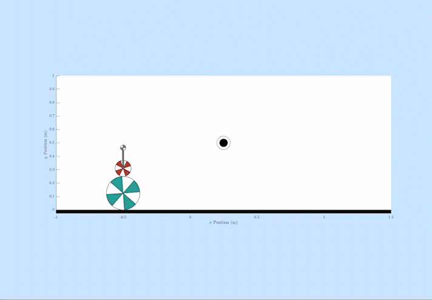

# Ballbot

This repo contains the dynamics, simulation, and control code for a planar ballbot system. A ballbot is a robot that balances atop a basketball and rolls the basketball underneath it in order to move about the world. Though similar to a segway, the ballbot is a particularly challenging system to control because its center of mass is significantly above the ball. This makes the dynamics more similar to an inverted pendulum on a cart. 

This code was developed for a class project in Applied Optimal Control taught by Dr. Christian Hubicki in the Winter 2023 semester. The course was offered in person to Florida A&M / Florida State Univerisity students and remotely to University of Michigan students. 

The dynamics and modeling theory for this project was inspired by the Bachelor's Thesis by Fankhauser and Gwerder [1]. 

## Getting Started
1) Before doing anything, run [`SETUP.m`](SETUP.m) to configure MATLAB paths. If you forget this step, you'll likely get lots of unknown function errors. 
2) The code in this repo is mainly organized in MATLAB Packages (Note the `+FolderName` notation). If you're unfamiliar with packages, read up on them on MathWorks's website before trying to edit the code or you'll likely be frustrated. 

## Dynamics and Simulation
This repo contains the code to derive the equations of motion of the system using Lagrangian Mechanics. To update the dynamics and get started with a test simulation, use the following steps:
1) Update the parameters in [`Ballbot.defineParams`](+Ballbot/defineParams.m)
2) Run [`Ballbot.genFunctions`](+Ballbot/genFunctions.m)
3) Run [`test_BallbotSimulation`](Tests/test_BallbotSimulation.m). In this script, you can modify the simulation parameters, such as the initial and final conditionds, constraints, and duration. 

## Control
The repo contains two control features: 1) A trajectory optimization built on multiple shooting that generates a control plan to move between two configurations in a minimum time. 2) A model predictive controller that stabilizes about the planned trajectory, rejects disturbances, and avoids obstacles. The system constraints, representing the physical limits of the system, are defined in [`Ballbot.defineConstraints.m`](+Ballbot/defineConstraints.m) and should be updated if the system parameters are changed. 

### Trajectory Optimization
The main trajectory optimization function is found in [`Control.optimze_trajectory_MS.m`](+Control/optimize_trajectory_MS.m). There is also a `mex` version of the same function at [`Control.optimze_trajectory_MS_mex.mexw64`](+Control/optimize_trajectory_MS_mex.mexw64) that executes much faster. To make a new `mex` file, the MATLAB Coder project file is also provided. An example usage of the trajectory optimization function is provided in [`Tests/test_optimize_trajectory_MS_mex.m`](Tests/test_optimize_trajectory_MS_mex.m). Note that you can supply `NaN` values in the desired state to have the optimizer ignore that state. For example, you can set `qdes = [0; NaN]` to tell the optimizer to ignore the lean angle and only care about the ballbot's horizontal location. 

### Model Predictive Control
The MPC implementation is primarily through 2 functions. The test script [`Tests/test_MPC.m`](Tests/test_MPC.m) shows the basic usage of the MPC features. 

First, call the [`Control.MPC.setup.m`](+Control/+MPC/setup.m) function to configure the MPC functions. This method automatically generates MATLAB functions used to calculate matrices used in the MPC quadratic program using the Symbolic Math Toolbox. Note that if you use an excessive number of horizon nodes, this process can be quite time consuming. For this reason, the functions are only regenerated if the code detects that the settings have changed. 

In each iteration of the loop, call [`Control.MPC.Run.m`](+Control/MPC.Run.m) to calculate the torque command for the current iteration. There is also a mex version of this function. If you modify the prediction horizon, this mex function will need to be rebuilt using the script [`Coder Scripts/codegenMPC_run.m`](<Coder Scripts/codegenMPC_run.m>)

## Documentation
The report detailing the theory behind this repository is included [here](Documentation/Ballbot_Control_Report.pdf).

## References
[1] P. Fankhauser and C. Gwerder, “Modeling and control of a ballbot,” Bachelor’s Thesis, ETH Zurich, 2010, online: https://www.research-collection.ethz.ch/bitstream/handle/20.500.11850/154271/eth-7943-01.pdf.
